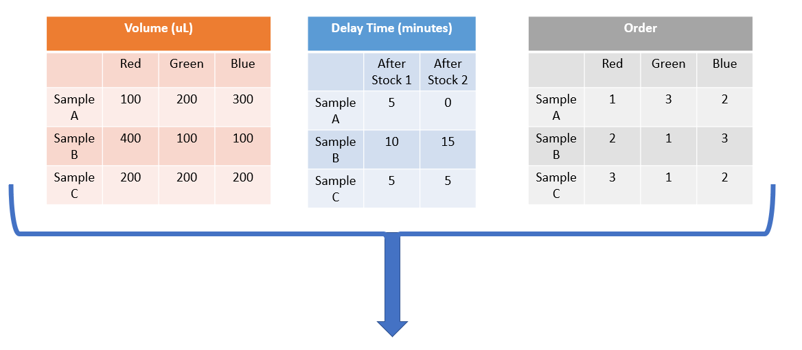
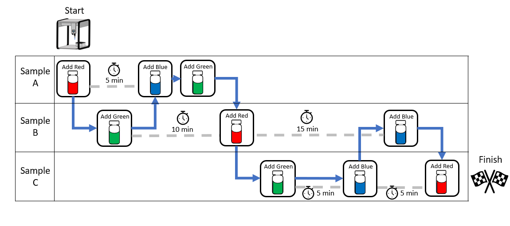
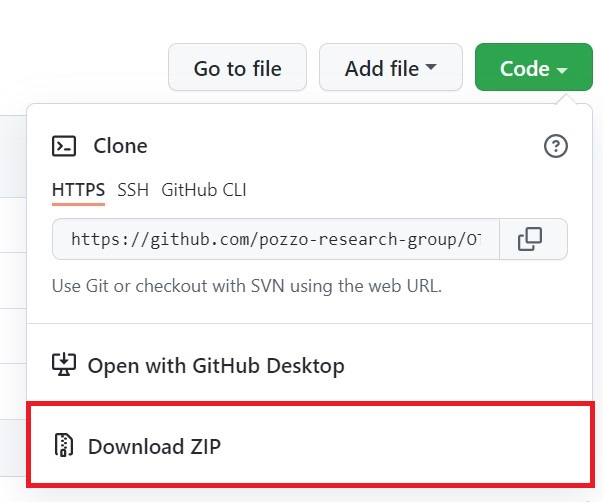
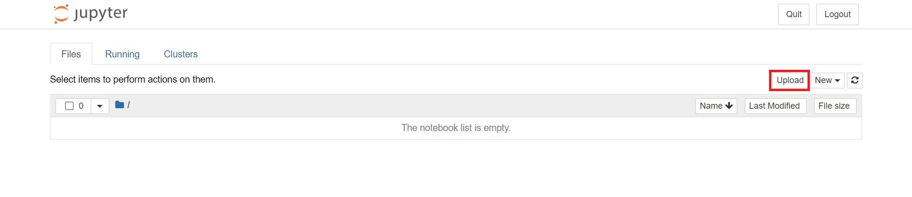
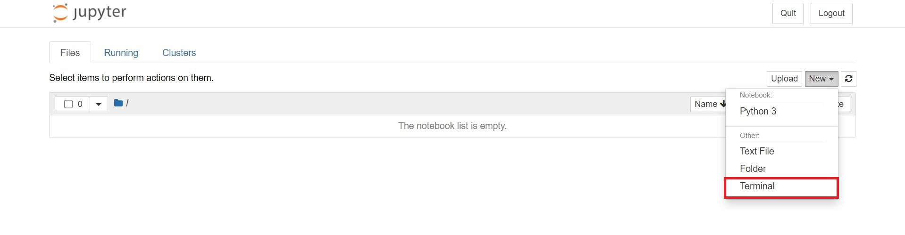

## Description 
This package is designed for the high-throughput chemical synthesis of materials where the time and order that the reagents are added have an effect on the material's final structure or property. Given the volumes of each stock solution to make a sample, the delay times between adding each stock solution, and the order of addition of the stocks, this package will determine the optimal schedule to synthesize the samples in the shortest amount of time. The schedule can then be performed using an Opentrons OT2 liquid handling robot. 




## Folders and Files 
There are several folders and files in this package, but only a few are required to run the code. 
### Sample_and_Protocol
This folder contains two subfolders:
- samples: The information on the samples such as the volumes, time delays, and order should be uploaded in this folder
- protocol: The information on the protocol such as the pipettes, labware, and labware positions should be uploaded in this folder. 

### OT2_code
This folder contains the code used to create the optimal schedule to create the samples and run the robot. You do not need to take any action on this folder to run the code. 
### Run_OT2.ipynb 
This is the notebook that will run the code. Further instructions are in the notebook. 

## Installation
The best way to use this package is from the jupyter notebook running directly on the OT2. Instructions on how to do this are as follows:

1. To install this package, first download the zip file from github.

<p align="center">

</p>

2. Open the jupyter notebook from the OT2 app.

<p align="center">

</p>

3. Upload the zip file to the OT2 jupyter notebook.

<p align="center">

</p>

4. Open the terminal.

<p align="center">
   
</p>

5. Run the following lines of code to unzip the file: 
```
	cd var/lib/jupyter/notebooks 
	unzip otto
```